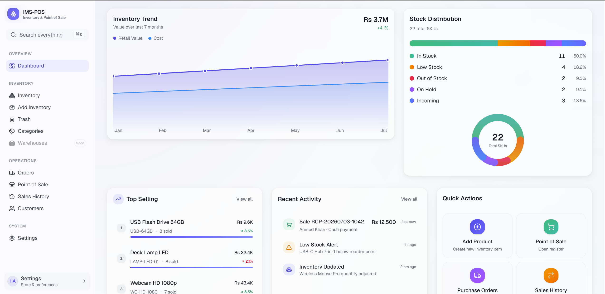
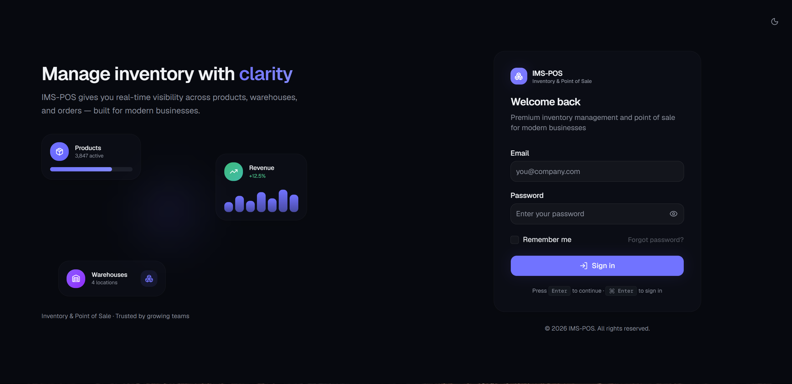
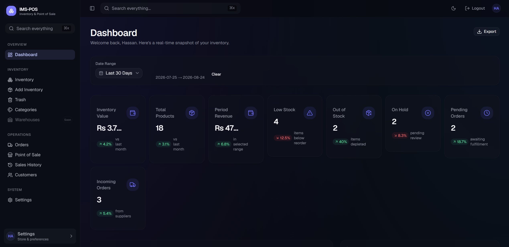
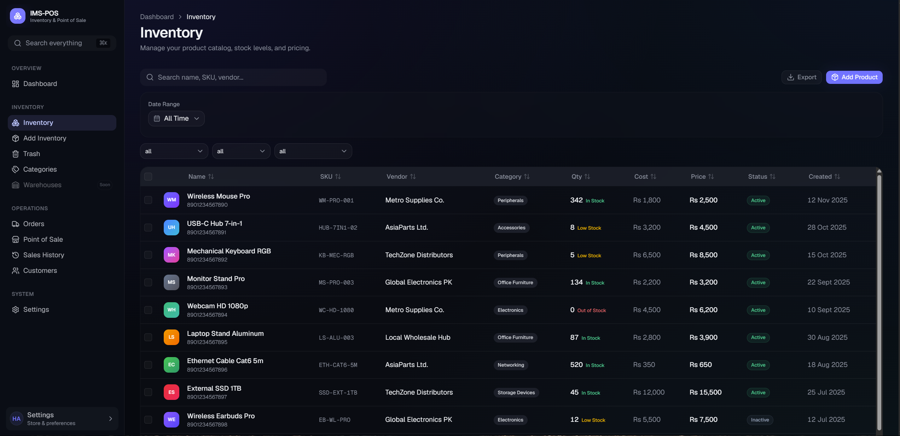
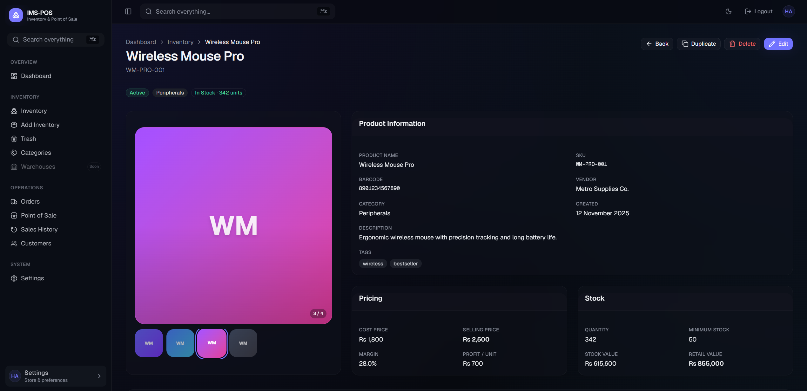
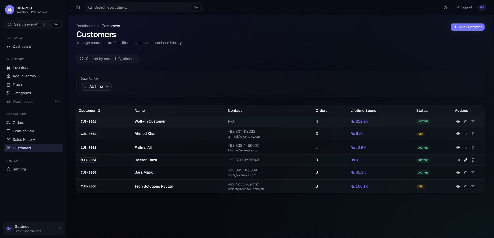
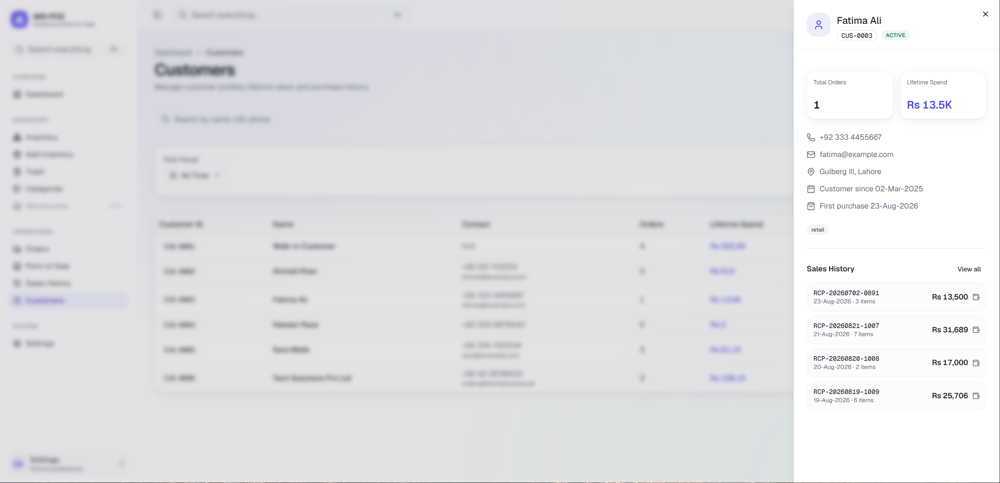
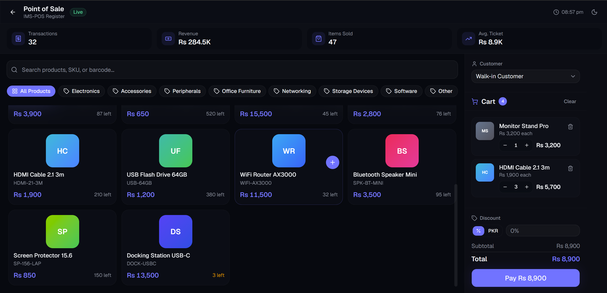

# Modern Inventory Management System & Point of Sale SaaS

  

<h1 align="center">IMS-POS</h1>

  <strong>Modern Inventory Management & Point of Sale SaaS</strong>

  A polished, responsive business platform designed to manage inventory,
  customers, purchasing, sales, and point-of-sale workflows from one place.

  <a href="https://imspos.vercel.app//">
    <strong>🚀 Live Demo</strong>
  </a>
  &nbsp;&nbsp;•&nbsp;&nbsp;
  <a href="https://github.com/mrhassansaif">
    GitHub
  </a>
  &nbsp;&nbsp;•&nbsp;&nbsp;
  <a href="https://www.linkedin.com/in/mr-hassansaif/">
    LinkedIn
  </a>

---

## ✨ Overview

**IMS-POS** is a modern Inventory Management & Point of Sale platform designed around the needs of retail businesses.

The interface combines a premium SaaS dashboard experience with practical business workflows, allowing a store to manage products, stock, customers, orders, sales, and POS operations from a unified application.

The product was designed to be **flexible rather than industry-specific**, making it suitable for different types of businesses and allowing the experience to be customized around individual client requirements.

### Built Around

* 🎨 Premium SaaS UI/UX
* 📦 Inventory Management
* 🛒 Point of Sale
* 👥 Customer Management
* 📋 Order Management
* 🧾 Receipt & PDF Generation
* 🔎 Global Search
* 📊 Business Dashboards
* 🌙 Dark / Light Mode
* 📱 Fully Responsive Experience

---

# 🚀 Live Demo

### Try IMS-POS

**[Open the Live Application →](https://imspos.vercel.app/)**

> The live deployment is provided as a product showcase and demonstration environment.

---

# 🧩 Core Features

## 📊 Dashboard

A high-level overview designed to let a store owner understand the current state of their business at a glance.

* Inventory KPIs
* Inventory value
* Total products
* Low-stock products
* Out-of-stock products
* On-hold products
* Incoming orders
* Pending orders
* Top-selling products
* Recent activity
* Inventory visualizations
* Quick actions
* Responsive dashboard widgets

---

## 📦 Inventory Management

Manage the entire product catalog through a polished inventory interface.

* Add products
* Edit products
* Product details
* Categories
* Tags
* SKU & barcode information
* Vendor information
* Cost & selling prices
* Stock quantity
* Minimum stock levels
* Product status
* Search
* Filters
* Sorting
* Pagination
* Bulk actions
* Soft delete
* Product restoration
* Product PDF export

---

## 👥 Customer Management

Keep customer information organized and connected to sales activity.

* Customer profiles
* Custom Customer IDs
* Phone numbers
* Addresses
* Customer notes
* Search by Customer ID
* Purchase history
* Lifetime spending
* Order history
* Customer details view

---

## 📋 Orders

Track incoming inventory and vendor orders through a clear operational workflow.

* Purchase orders
* Order status tracking
* Pending orders
* Approved orders
* Ordered inventory
* Incoming inventory
* Completed orders
* Order timelines
* Order details

---

## 🛒 Point of Sale

A dedicated POS interface designed for fast in-store transactions.

* Product search
* Category filtering
* Shopping cart
* Quantity controls
* Customer selection
* Discounts
* Payment selection
* Checkout workflow
* Receipt generation
* Print-ready receipts
* PDF receipts
* Mobile-friendly checkout

---

## 🧾 Receipts & Reports

Professional outputs designed for both operational use and presentation.

* Branded receipts
* Printable receipts
* PDF receipts
* Inventory PDF exports
* Sales history PDF exports
* Store branding
* Print-friendly layouts

---

# 🎨 Design & User Experience

The application was designed to feel closer to a premium SaaS product than a traditional admin panel.

### UI Principles

* Glassmorphism-inspired surfaces
* Clean typography
* Strong visual hierarchy
* Subtle shadows
* Modern cards
* Consistent spacing
* Premium interactions
* Smooth micro-animations
* Dark & Light themes
* Responsive layouts
* Accessible keyboard interactions
* Loading skeletons
* Toast feedback
* Mobile navigation

### Responsive Design

Designed to adapt across:

**4K → Desktop → Laptop → Tablet → Mobile → Small screens**

The interface is built mobile-first while preserving a high-density desktop experience.

---

# 🖼️ Screenshots

## Login

  

---

## Dashboard

  

---

## Dashboard Statistics — Light Mode

  

---

## Inventory Management

  

---

## Product Details

  

---

## Customer Management

  

---

## Customer Details

  

---

## Point of Sale

  

---

# 🛠️ Tech Stack

| Technology          | Purpose                     |
| ------------------- | --------------------------- |
| **Next.js**         | Application framework       |
| **React**           | UI development              |
| **TypeScript**      | Type-safe development       |
| **Tailwind CSS**    | Styling & responsive design |
| **shadcn/ui**       | Reusable UI components      |
| **Framer Motion**   | Animations & transitions    |
| **Lucide**          | Icon system                 |
| **Sonner**          | Toast notifications         |
| **React Hook Form** | Form management             |
| **Zod**             | Validation                  |
| **TanStack Table**  | Data tables & interactions  |

---

# 🏪 Designed for Flexible Business Use

IMS-POS is intentionally designed as a **general-purpose retail platform** rather than something locked to one type of store.

It can be adapted for:

| Business          | Potential Use                 |
| ----------------- | ----------------------------- |
| 📚 Stationery     | Products, stock, POS          |
| 🛒 Grocery        | Inventory, sales, customers   |
| 💊 Medical Store  | Products, stock tracking, POS |
| 💻 Electronics    | SKU, products, inventory      |
| 👕 Clothing       | Catalog, stock, POS           |
| 🔧 Hardware       | Inventory & purchasing        |
| 📦 Wholesale      | Products, vendors & orders    |
| 🏬 General Retail | Complete store operations     |

The interface and workflows can be customized around the requirements of an individual business.

---

# 🔒 Source Code

The complete application source code is **private**.

This public repository is intentionally maintained as a **showcase repository** for:

* Product design
* UI/UX
* Feature presentation
* Screenshots
* Live demonstration
* Portfolio purposes

The proprietary implementation and source code are not included in this repository.

### Interested in the actual product?

Feel free to get in touch for:

* Custom implementations
* Client-specific modifications
* Feature additions
* UI/UX customization
* Business workflow customization

---

# 🎯 Project Focus

IMS-POS was built with a simple philosophy:

> **Business software should be powerful without feeling complicated.**

The goal was to combine practical inventory workflows with a modern product experience so that business owners and staff can focus on their work rather than fighting the software.

---

# 📬 Contact

### Hassan Saif

**GitHub**
[github.com/mrhassansaif](https://github.com/mrhassansaif)

**LinkedIn**
[linkedin.com/in/mr-hassansaif](https://www.linkedin.com/in/mr-hassansaif/)

**Email**
[hassansaif0ki@gmail.com](mailto:hassansaif0ki@gmail.com)

---

  <strong>IMS-POS</strong>
   
  Inventory Management • Point of Sale • Modern SaaS UI
    
  ⭐ Built as a professional product showcase

---

## License

This repository is provided for portfolio and product showcase purposes.

The implementation and proprietary source code are not included.

**All rights reserved.**
